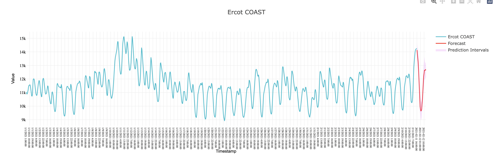

# Use Nixtla API and Plotly

# Reproducibility

1. Request a token access [here](http://18.235.133.135:3000/login).
2. Replace the placeholder in `plot.js` with your token.
3. Launch a server with 

```bash
python -m http.server 8000
```

You'll find a plot like the following,


